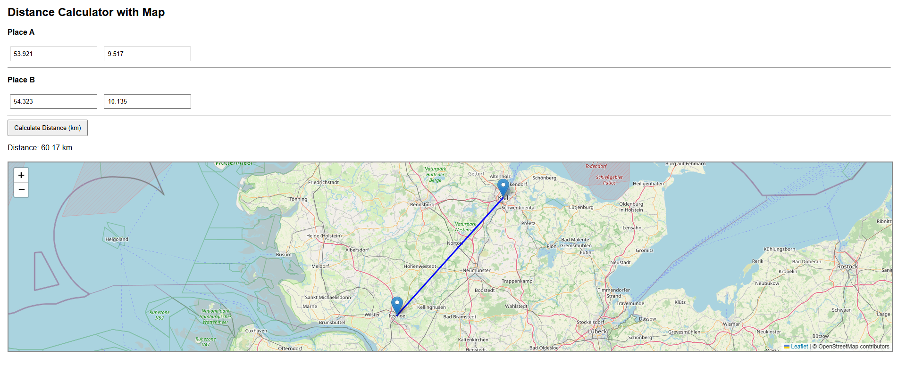

# 🌍 Sayed Mosavi – WebGIS Portfolio

Welcome to my personal WebGIS and GIS portfolio.  
Here I document small, practical projects that demonstrate my skills in **GIS**, **remote sensing**, and **web mapping**.

---

## 🧭 Projects

### 🗺️ [Distance Calculator](./Distance-Calculator/distance.html)
**Technology:** Node.js + Leaflet + OpenStreetMap  
**Description:**  
A WebGIS demo that calculates great-circle distance between two coordinates, displays both points on a map, and visualizes the connecting line.  
Backend written in Node.js; frontend with Leaflet and Fetch API.

---

More projects coming soon:
- QGIS automation and spatial analysis demos  
- WebGIS dashboards for environmental data (ArcGIS & Leaflet)
- Regional GIS data tools for Schleswig-Holstein

---

📫 **Contact:**  
[LinkedIn](www.linkedin.com/in/sayed-hussain-mosavi) • [GitHub](https://github.com/HussainMosavi)
